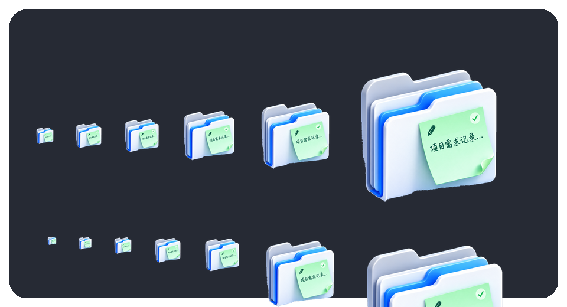

# 文笺 FileMemo —— 签随文件走的超级便签

> 每份文件都值得一纸文笺：图文备注 · 五重指纹追踪 · 文件树 · Everything 联合搜索

> 在 Windows 文件系统之上，增加一层"人的上下文"。
<p align="center">
  
</p>

> 本仓库是依据《文笺 FileMemo APP 需求文档（优化整合版 v2.0）》落地的 **v1.0 正式版** 源码工程。

---

## 界面与视觉预览

**应用图标**（3D 文件夹 + 绿色便签）

<p align="center">
  
  &nbsp;&nbsp;&nbsp;
  
</p>

**桌面悬浮球**（主球贴图 + 磁贴图标）

<p align="center">
  
</p>

**展开面板动作图标**（便签 / 剪贴板 / 待办 / 文件·文件夹备注）

<p align="center">
  
  &nbsp;
  
  &nbsp;
  
  &nbsp;
  
</p>

---

## 一、这是什么

文笺 FileMemo 把 **便签 / 剪贴板随记 / 待办 / 文件·文件夹备注** 统一成一套"记录（Record）"对象模型，
并叠加 **多重指纹追踪**（文件重命名 / 移动后备注自动同步）、**文件树**、**Everything 联合搜索**、
**资源管理器集成**、**桌面 Widget**，本地优先、离线可用。

- 平台：Windows 10 / Windows 11
- 技术：.NET 8 + WPF（Fluent / Mica & Acrylic 风格）+ SQLite(FTS5) + DPAPI
- 定位：纯 Windows 桌面端，**不引入 AI**

---

## 二、环境要求

| 项 | 要求 |
| --- | --- |
| 操作系统 | Windows 10 1809+ / Windows 11 |
| 运行时 | [.NET 8 SDK](https://dotnet.microsoft.com/download/dotnet/8.0) |
| 可选 | [Everything](https://www.voidtools.com/)（配 `es.exe` 获得最佳文件搜索） |
| IDE | Visual Studio 2022 / JetBrains Rider（可选） |

> 说明：本工程为 Windows 专属（WPF + Win32 API），**只能在 Windows 上编译运行**。

---

## 三、快速开始

```powershell
# 1. 编译（在仓库根目录或解决方案目录均可）
dotnet build FileMemo.sln -c Debug

# 2. 运行
dotnet run --project src\FileMemo.App -c Debug
# 或直接运行生成的可执行文件：
#   src\FileMemo.App\bin\Debug\net8.0-windows\FileMemo.exe
```

首次启动会在 `%APPDATA%\SuperNote\` 下创建：

```
supernote.db          # SQLite 主库（含 FTS5 全文索引）
attachments\          # 剪贴板图片等附件
settings.json         # 应用设置
```

### 可选：注册资源管理器右键菜单

```powershell
cd scripts
./install-context-menu.ps1          # 注册（当前用户，无需管理员）
./install-context-menu.ps1 -Uninstall  # 卸载
```

---

## 四、v1.0 已实现功能

| 模块 | 状态 | 说明 |
| --- | --- | --- |
| 普通便签 | ✅ | 编辑 / 标签 / 置顶 / FTS5 搜索 / [[双向链接]] 解析 |
| 剪贴板随记 | ✅ | 文本 / 图片 / 文件路径 / HTML 监听，自动去重、敏感应用过滤、分级加密 |
| 基础待办 | ✅ | 标题 / 描述 / 状态 / 优先级 / 截止时间 / 文件关联 |
| 文件·文件夹备注 | ✅ | 富文本内容 + 状态 + 标签 + 意图 + 来源 + 负责人 + 时间线 |
| 多重指纹 | ✅ | 主指纹（卷 GUID + NTFS File ID）+ 辅助指纹（路径/大小/时间/哈希） |
| 文件树 | ✅ | 按备注覆盖聚合，备注图标 / 状态 / 待办数 |
| Everything 联合搜索 | ✅ | 调用 es.exe；未安装自动降级到内置索引 |
| 资源管理器集成 | ✅ | 右键菜单脚本 + **全局快捷键呼出备注弹窗**（对选中文件/文件夹直接备注 / 回显已有备注）；内嵌叠加面板为后续版本规划 |
| 桌面 Widget | ✅ | 快速便签 / 待办 / 剪贴板 |
| 统一对象模型 | ✅ | Record / Clip / Task / FileRef / Annotation / Fingerprint / Timeline / Link |
| 本地 SQLite + 分级加密 | ✅ | DPAPI 加密敏感字段；普通便签可明文 |

图例：✅ 已实现 · ⚠️ 部分实现 · ⬜ 规划中

### 快捷键呼出备注弹窗（核心交互）

在资源管理器中**选中一个或多个文件/文件夹**后，按下快捷键（默认 **Ctrl+Alt+A**）：

- 若该对象**尚未备注** → 弹出备注窗口，可直接填写内容 / 状态 / 标签 / 意图并保存；
- 若该对象**已备注** → 弹窗自动**回显已有备注**，可查看或继续编辑；
- 多选时 → 对选中的每一项批量写入同一份备注。

实现要点：

1. 通过 Shell.Application 读取资源管理器**当前选中项**（优先前台窗口）；
2. 无选中项时依次回退：剪贴板中的文件列表 → 手动输入路径对话框；
3. 弹窗在鼠标附近出现，保存时自动建立/更新**指纹**，保证日后重命名/移动仍能关联。

其它快捷键（可在\"设置\"中修改）：

| 快捷键 | 功能 |
| --- | --- |
| `Ctrl+Alt+A` | 对资源管理器选中项呼出备注弹窗 |
| `Ctrl+Alt+N` | 快速便签 |
| `Ctrl+Alt+V` | 剪贴板面板 |

> 右键菜单亦可直接呼出：注册右键菜单脚本后，对文件/文件夹点\"添加/查看文笺 FileMemo\"即触发备注弹窗。

---

## 五、工程结构

```
FileMemo/
├─ FileMemo.sln
├─ README.md
├─ docs/
│   └─ roadmap.md                 # 路线图与设计决策
├─ scripts/
│   └─ install-context-menu.ps1   # 右键菜单注册
└─ src/FileMemo.App/
    ├─ App.xaml(.cs)              # 入口：初始化 DB / 服务 / 托盘
    ├─ app.manifest               # Per-Monitor V2 DPI
    ├─ Models/                    # 统一对象模型 + 枚举
    ├─ Data/                      # Database（建表/FTS5）+ Repository（CRUD/搜索）
    ├─ Services/                  # 剪贴板/指纹/热键/Everything/文件监听/Markdown/加密/设置
    ├─ Interop/                   # Win32 P/Invoke（热键/剪贴板/File ID/卷 GUID）
    ├─ ViewModels/                # MainViewModel + RelayCommand
    ├─ Converters/                # 值转换器
    ├─ Themes/                    # Tokens.xaml + Controls.xaml（设计令牌与组件）
    └─ Views/                     # MainWindow + 快速便签/剪贴板/Widget/悬浮卡/添加对话框
```

---

## 六、设计规范落地

颜色、字体、间距、圆角、阴影、材质等 **严格对齐需求文档第 4 章**，定义在
`Themes/Tokens.xaml`；组件状态（Normal/Hover/Pressed/Focused/Disabled/Selected）
定义在 `Themes/Controls.xaml`。

- 主色 `#0078D4`，语义色 success/warning/danger
- 字号阶梯 Display→Tiny，主要使用 400 / 600
- 间距 4px 基准；圆角页面 12 / 卡片 8 / 控件 6 / 标签 999
- 普通卡片无阴影，浮层使用双层柔和阴影
- Mica/Acrylic 不可用时降级为纯色（`#F7FAFD` / `#292929`）

---

## 七、v1.0 增强功能

| 模块 | 实现位置 | 说明 |
| --- | --- | --- |
| USN Journal 实时追踪 | `Services/UsnJournalService.cs` | 按卷订阅 USN，File ID 对齐主指纹；非 NTFS/无权限自动降级 FileSystemWatcher |
| 哈希兜底 + 跨卷候选 | `Services/FingerprintService.cs` | `Resolve` 三级回退：File ID → 卷序列号 → 哈希/名称相似度候选 |
| 网络盘 / NAS | `FingerprintService` + `file_ref.is_network/volume_serial` | 卷序列号指纹 + 内置索引 `FindByVolumeSerial` |
| sidecar 可配置 | `Services/SidecarService.cs` | JSON/YAML、隐藏/可见、同目录/集中目录、命名后缀 |
| 图片 OCR 搜索 | `Services/OcrService.cs` | Windows.Media.Ocr；`clip.ocr_text` / `annotation.ocr_text` 参与搜索 |
| 云同步（预留） | `Services/CloudSyncService.cs` | WebDAV PUT/GET + DPAPI 传输加密 + `.conflict` 冲突备份；只同步 SQLite 主库 |
| 版本关系链 | `Services/VersionService.cs` + `version_link` 表 | 手动为主 + 同目录/相似名/相似大小/时间接近自动推荐 |
| 副本继承策略 | `Services/CopyInheritService.cs` | Ask / Always / Never / SameDirOnly / SidecarOnly |
| 双向链接 / 反向链接 | `Services/LinkService.cs` | 解析 `[[标题]]`，维护 `record_link`，提供反向链接查询 |
| 时间线可配置 | `Settings.TimelineEnabledCategories` | 默认仅备注编辑 + 文件关键变化，可开启完整事件流 |

以上增强功能开关均可在**设置**面板中调整（设置区已新增「追踪与迁移 / sidecar / OCR / 云同步 / 副本继承 / 时间线」分组）。

### 桌面文件 / 文件夹备注（已修复）

早期版本在**桌面**上添加备注时会误报「无法直接添加」并跳转手动输入路径，根因是
`Shell.Application.FindWindowSW` 的 `pHWND` 参数为 `[out] LONG*`，直接传普通 `int` 会封送失败、
桌面永远取不到选中路径。修复后 `ExplorerSelectionService` 采用三级路径：

1. `FindWindowSW(SWC_DESKTOP)` 正确封送读取桌面 Shell 视图选中项；
2. Win32 直读桌面 `SysListView32`（跨进程 `LVM_GETNEXTITEM`/`LVM_GETITEMTEXTW`）再解析为完整路径；
3. 资源管理器窗口枚举（优先前台窗口）。

---

## 八、v1.0 高级功能（可选模块）

| 模块 | 实现位置 | 说明 |
| --- | --- | --- |
| 关系图谱 / 知识网络视图 | `Services/GraphService.cs` + `Views/GraphWindow.xaml(.cs)` | 把便签、文件备注、待办及其 `[[双向链接]]` / 版本关系 / 待办挂靠 / 普通引用构建成节点-边网络；轻量力导向布局，支持拖动、右键聚焦邻域、双击查看 |
| 图片向量搜索 | `Services/ImageVectorService.cs` | **纯本地** 148 维特征向量（8×8 灰度 64 + 4×4×4 颜色直方图 64 + 4×4 边缘密度 16 + 全局统计 4），余弦相似度检索；**不引入任何 AI 模型或云服务** |
| 团队协作（预留） | `Services/CollaborationService.cs` | `ICollaborationProvider` 抽象 + `LocalOnly` 本地占位 + `collab_session` 工作区 / 成员元数据模型；默认本地，不连远端 |
| 插件系统 | `Services/PluginService.cs` | `IPlugin` / `PluginContext` / `PluginHost`；`AssemblyLoadContext`（可卸载）隔离加载，单插件失败不影响主程序；插件目录可配置 |
| 后台服务（可选） | `Services/BackgroundServiceHost.cs` + `scripts/install-service.ps1` | `FileMemo.exe --service` 无界面模式：大规模 USN Journal 追踪 + 网络盘 / NAS 监控 + 开机索引（含图片向量）；脚本以管理员注册 Windows 服务（sc.exe / NSSM） |

以上高级功能开关均在**设置**面板的「关系图谱 / 知识网络 / 图片向量 / 团队协作 / 插件系统 / 后台服务」分组中调整；
并提供「打开知识网络」「重建向量索引」按钮。

> 高级功能数据表：`image_vector` · `plugin` · `collab_session`（见 `Data/Database.P2.cs`）。

---

## 八·补、应用图标与桌面悬浮球

**应用图标**：全应用统一为需求指定的「3D 文件夹 + 绿色便签」图标。
- `Assets/appicon.png`（窗口图标，通过 `App.xaml` 的全局 `Window` 样式设置）
- `Assets/appicon.ico`（EXE 可执行文件图标，`FileMemo.App.csproj` 的 `<ApplicationIcon>`）

<p align="center">
  
</p>

**桌面悬浮球**（`Views/FloatingBallWindow.xaml(.cs)`，可个性化）：
- 常驻桌面、置顶、可整窗拖动、自动记忆位置、点击空白可穿透
- **可个性化**：球的**个数**（1–5，主球 + 卫星球）、**直径**（40–96px）、**不透明度**、
  **卫星球配色**（十六进制）、主球是否用 3D 贴图、是否显示小红点、长按判定时长
- 主球：单击唤出主窗口，右键弹出常用入口（主窗口 / 快速便签 / 剪贴板 / 桌面速览 / 收纳 / 释放 / 退出）
- **小红点**：单击「一键收纳 / 释放」全部便签浮窗；长按弹出更多操作菜单
- **粒子消散特效**：选择「退出（粒子消散）」时，主球 / 卫星球 / 红点位置爆散出粒子并淡出，
  约 1.1s 后退出应用（仪式感）
- 所有开关在**设置 → 桌面悬浮球**分组中调整，改动即时重建生效
- 后台接线：`App.xaml.cs` 新增 `BuildFloatingBall / RebuildFloatingBall / CloseFloatingBall`
  与 `CollapseAllNotes / ReleaseAllNotes / MinimizeAllNotes / ToggleCollapseNotes`，
  并维护便签浮窗登记表 `_noteWindows` 供批量收纳 / 释放

---

## 九、已知限制（见 docs/roadmap.md）

- 资源管理器**内嵌**浮动面板未实现（用独立悬浮卡替代，Windows Shell 扩展在 MSIX 下受限）
- 云同步 OneDrive OAuth 授权流程待接入（WebDAV 已可用）
- 图片 OCR 依赖系统已安装对应语言包；缺失时自动降级不报错
- 一次性在**沙箱**中编写，未在 Windows 上编译验证——首次本地编译如遇包版本差异，
  请以 `dotnet restore` 的实际提示为准

---

## 十、数据与隐私

- 数据默认全部保存在本机 `%APPDATA%\SuperNote\`，离线可用
- 剪贴板 / 文件路径 / 文件备注等敏感字段使用 **DPAPI(CurrentUser)** 加密
- 剪贴板支持应用排除列表，密码管理器等可加入屏蔽
